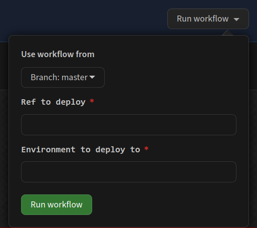

# cadet-frontend CS1101S deployment

This repository contains deployment scripts for the CS1101S staging and
production deployments of
[cadet-frontend](https://github.com/source-academy/cadet-frontend).

The `master` branch contains the GitHub workflow file. The actual frontend
source should be pushed to any other branch.

To deploy:

1. Push the commit(s) you want to deploy to the `deploy` branch (or any other
   branch).
1. Go to the ["Deploy cadet-frontend" workflow on this
   repository](https://github.com/NUS-CS1101S/cadet-frontend/actions?query=workflow%3A%22Deploy+cadet-frontend%22).
1. Click on "Run workflow" and fill in the environment (`stg` or `prod`) and ref
   (the branch name or commit hash) to deploy.

   
1. Verify you've keyed in the correct environment.
1. 🤞 Cross your fingers and hit the green "Run workflow".
